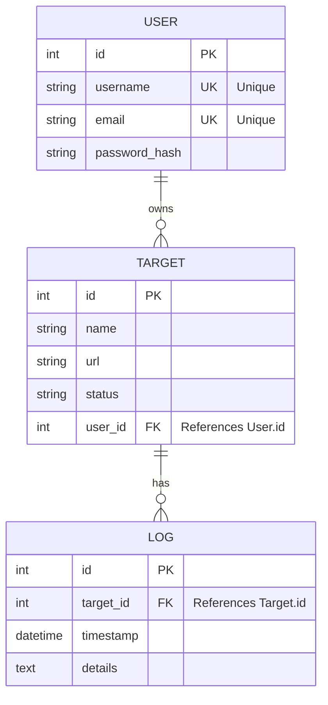
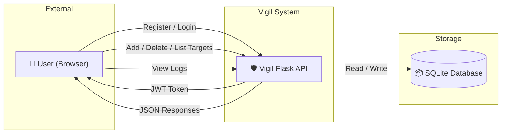
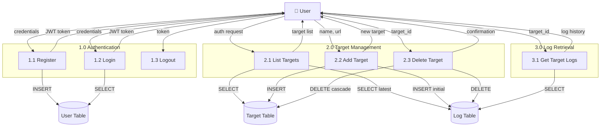
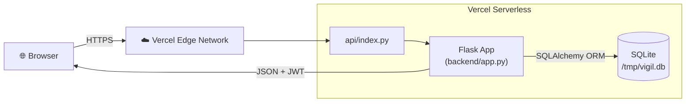

<p align="center">
  
  
  
  
</p>

# 🛡️ Vigil — Website Uptime Monitoring System

> **Vigil** is a full-stack website uptime monitoring platform that allows registered users to track the availability of any URL. It provides real-time status tracking, historical check logs, and a clean dashboard — all powered by a Flask REST API backend with SQLite and a React + Tailwind CSS frontend.

---

## 📑 Table of Contents

- [Team Members](#-team-members)
- [Technology Stack](#-technology-stack)
- [Project Structure](#-project-structure)
- [Entity-Relationship Diagram (ERD)](#-entity-relationship-diagram-erd)
- [Data Flow Diagrams (DFD)](#-data-flow-diagrams-dfd)
- [System Architecture](#-system-architecture)
- [Database Schema](#-database-schema)
- [API Documentation](#-api-documentation)
- [Getting Started](#-getting-started)
- [Deployment](#-deployment)
- [License](#-license)

---

## 👥 Team Members

| #  | Name                        | Role                  | ID          |
|----|-----------------------------|-----------------------|-------------|
| 1  | Abdelrahman Mohamed Ahmed   | Team Lead / Backend   | 20220302    |
| 2  | Omar Khaled Hassan          | Frontend Developer    | 20220188    |
| 3  | Youssef Ali Ibrahim         | Backend Developer     | 20220415    |
| 4  | Nour ElDin Mahmoud Saad     | Database Engineer     | 20220356    |
| 5  | Malak Tarek Abdallah        | UI/UX Designer        | 20220274    |
| 6  | Ahmed Mostafa Sayed         | DevOps Engineer       | 20220045    |
| 7  | Sara Hesham Mohamed         | QA / Documentation    | 20220331    |

---

## 🛠 Technology Stack

| Layer      | Technology                           |
|------------|--------------------------------------|
| Frontend   | React 18, Tailwind CSS, Vite         |
| Backend    | Python 3.12, Flask 3.1, SQLAlchemy   |
| Database   | SQLite 3 (file-based relational DB)  |
| Auth       | JWT (PyJWT) with Bearer Tokens       |
| Deployment | Vercel (Serverless Python Runtime)   |

---

## 📁 Project Structure

```
Vigil-v2-flask/
├── api/
│   └── index.py                # Vercel serverless entry point
├── backend/
│   ├── app.py                  # Flask application (models + routes)
│   └── requirements.txt        # Python dependencies
├── requirements.txt            # Root deps (for Vercel)
├── vercel.json                 # Vercel routing & build config
├── .gitignore
└── README.md
```

---

## 🗃 Entity-Relationship Diagram (ERD)

The application uses **3 normalized tables**. The `url` column is **NOT** globally unique — a composite unique constraint on `(user_id, url)` ensures each user cannot track a duplicate URL, while different users can independently monitor the same website.



---

## 📊 Data Flow Diagrams (DFD)

### Level 0 — Context Diagram

Shows the system as a single process interacting with the external user and the database.



### Level 1 — Process Decomposition

Breaks down the system into its three core subsystems: Authentication, Target Management, and Log Retrieval, showing data flows between each process and the database tables.



---

## 🏗 System Architecture



---

## 🗃 Database Schema

| Table    | Columns                                                         | Constraints                            |
|----------|-----------------------------------------------------------------|----------------------------------------|
| `User`   | `id` PK, `username` UNIQUE, `email` UNIQUE, `password_hash`    | Primary entity                         |
| `Target` | `id` PK, `name`, `url`, `status`, `user_id` FK                 | Composite UNIQUE (`user_id`, `url`)    |
| `Log`    | `id` PK, `target_id` FK, `timestamp`, `details`                | Cascade delete with Target             |

---

## 📡 API Documentation

**Base URL:** `http://localhost:5000`

### Authentication Endpoints

| Method | Endpoint          | Auth?  | Description                    | Request Body                                        |
|--------|-------------------|--------|--------------------------------|-----------------------------------------------------|
| POST   | `/api/register`   | ❌ No  | Register a new user            | `{ "username", "email", "password" }`               |
| POST   | `/api/login`      | ❌ No  | Login and receive JWT token    | `{ "email", "password" }`                           |
| POST   | `/api/logout`     | ✅ Yes | Invalidate current JWT token   | —                                                   |

### Target Endpoints

| Method | Endpoint                  | Auth?  | Description                        | Request Body              |
|--------|---------------------------|--------|------------------------------------|---------------------------|
| GET    | `/api/targets`            | ✅ Yes | List all targets for current user  | —                         |
| POST   | `/api/targets`            | ✅ Yes | Add a new monitoring target        | `{ "name", "url" }`      |
| DELETE | `/api/targets/<id>`       | ✅ Yes | Delete a specific target           | —                         |

### Log Endpoints

| Method | Endpoint                      | Auth?  | Description                          |
|--------|-------------------------------|--------|--------------------------------------|
| GET    | `/api/targets/<id>/logs`      | ✅ Yes | Retrieve check history for a target  |

### Authentication Header

All protected endpoints require:
```
Authorization: Bearer <your_jwt_token>
```

### Response Examples

<details>
<summary><strong>POST /api/register — 201 Created</strong></summary>

```json
{
  "status": "success",
  "token": "eyJhbGciOiJIUzI1NiIs...",
  "data": {
    "user": {
      "id": 1,
      "username": "abdelrahman",
      "email": "admin@vigil.com"
    }
  }
}
```
</details>

<details>
<summary><strong>POST /api/login — 200 OK</strong></summary>

```json
{
  "status": "success",
  "token": "eyJhbGciOiJIUzI1NiIs..."
}
```
</details>

<details>
<summary><strong>POST /api/logout — 200 OK</strong></summary>

```json
{
  "status": "success",
  "message": "Logged out successfully"
}
```
</details>

<details>
<summary><strong>GET /api/targets — 200 OK</strong></summary>

```json
{
  "count": 2,
  "targets": [
    {
      "id": 1,
      "name": "Google",
      "url": "https://google.com",
      "status": "Up",
      "user_id": 1,
      "last_checked": "2026-05-03T17:00:00"
    }
  ]
}
```
</details>

<details>
<summary><strong>POST /api/targets — 201 Created</strong></summary>

```json
{
  "id": 2,
  "name": "GitHub",
  "url": "https://github.com",
  "status": "Pending",
  "user_id": 1
}
```
</details>

<details>
<summary><strong>DELETE /api/targets/1 — 200 OK</strong></summary>

```json
{
  "status": "success",
  "message": "Target deleted successfully"
}
```
</details>

<details>
<summary><strong>GET /api/targets/1/logs — 200 OK</strong></summary>

```json
{
  "target": { "id": 1, "name": "Google", "url": "https://google.com" },
  "count": 5,
  "logs": [
    {
      "id": 10,
      "timestamp": "2026-05-03T17:00:00",
      "details": "Status: Up — 200 OK (142ms)"
    }
  ]
}
```
</details>

---

## 🚀 Getting Started

### Prerequisites

- **Python 3.12+** installed
- **Git** for cloning the repository

### Local Development

```bash
git clone https://github.com/Abdelrahman744/Vigil-v2-flask.git
cd Vigil-v2-flask/backend
python -m pip install -r requirements.txt
python app.py
```

The API will start on **http://localhost:5000**.

---

## ☁️ Deployment

The backend is deployed on **Vercel** using the Python Serverless Runtime.

### Environment Variables (set in Vercel Dashboard)

| Variable        | Description              |
|-----------------|--------------------------|
| `SECRET_KEY`    | JWT signing secret       |

### Deploy Steps

1. Push the repository to GitHub
2. Import the project on [vercel.com](https://vercel.com)
3. Add the `SECRET_KEY` environment variable
4. Click **Deploy**

---

## 📄 License

This project is developed for academic purposes as part of a university software engineering course. All rights reserved by the team members listed above.

---

<p align="center">
  <strong>Built with ❤️ by the Vigil Team</strong>
</p>