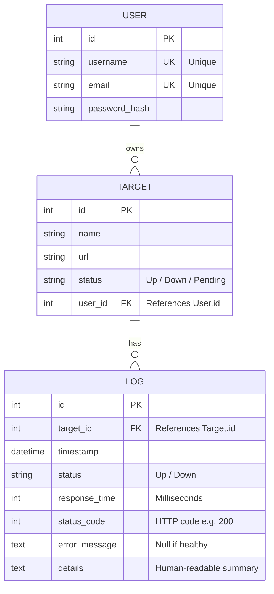
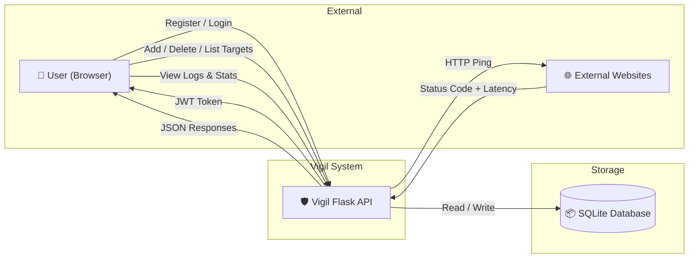
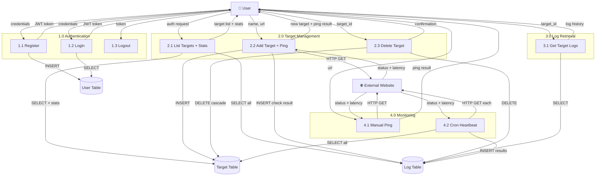
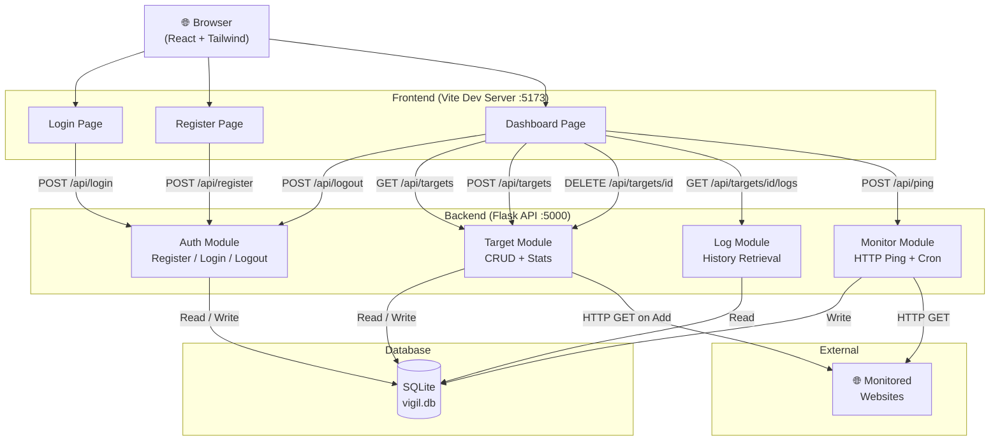

<p align="center">
  
  
  
  
  
</p>

# 🛡️ Vigil — Website Uptime Monitoring System

> **Vigil** is a full-stack website uptime monitoring platform that allows registered users to track the availability of any URL. When a target is added, the system immediately pings the website and records its **status** (Up / Down), **HTTP status code**, and **response time**. Users can view real-time stats such as **availability percentage** and **average latency**, browse full check-history logs, and manage their monitored sites — all through a modern React dashboard backed by a Flask REST API.

---

## 📑 Table of Contents

- [Team Members](#-team-members)
- [Technology Stack](#-technology-stack)
- [Project Structure](#-project-structure)
- [Entity-Relationship Diagram (ERD)](#-entity-relationship-diagram-erd)
- [Data Flow Diagrams (DFD)](#-data-flow-diagrams-dfd)
- [System Architecture](#-system-architecture)
- [Database Schema](#-database-schema)
- [API Documentation](#-api-documentation)
- [Frontend Pages](#-frontend-pages)
- [Getting Started](#-getting-started)
- [License](#-license)

---

## 👥 Team Members

| #  | Name                        | Role                  | ID          |
|----|-----------------------------|-----------------------|-------------|
| 1  | Abdelrahman Mohamed Ahmed   | Team Lead / Backend   | 20220302    |
| 2  | Omar Khaled Hassan          | Frontend Developer    | 20220188    |
| 3  | Youssef Ali Ibrahim         | Backend Developer     | 20220415    |
| 4  | Nour ElDin Mahmoud Saad     | Database Engineer     | 20220356    |
| 5  | Malak Tarek Abdallah        | UI/UX Designer        | 20220274    |
| 6  | Ahmed Mostafa Sayed         | DevOps Engineer       | 20220045    |
| 7  | Sara Hesham Mohamed         | QA / Documentation    | 20220331    |

---

## 🛠 Technology Stack

| Layer      | Technology                                     |
|------------|-------------------------------------------------|
| Frontend   | React 18, Tailwind CSS v4, Vite, Framer Motion |
| Backend    | Python 3.12, Flask 3.1, SQLAlchemy              |
| Database   | SQLite 3 (file-based relational DB)             |
| Auth       | JWT (PyJWT) with Bearer Tokens                  |
| Monitoring | Python `requests` library (HTTP pinging)        |
| Deployment | Vercel (Serverless Python Runtime)              |

---

## 📁 Project Structure

```
Vigil-v2-flask/
├── api/
│   └── index.py                    # Vercel serverless entry point
├── backend/
│   ├── app.py                      # Flask API (models, routes, monitoring)
│   └── requirements.txt            # Python dependencies
├── frontend/
│   ├── src/
│   │   ├── api.js                  # Axios client with JWT interceptor
│   │   ├── App.jsx                 # Router & protected routes
│   │   ├── main.jsx                # React entry point
│   │   ├── index.css               # Tailwind v4 theme & global styles
│   │   └── pages/
│   │       ├── Login.jsx           # Login page (POST /api/login)
│   │       ├── Register.jsx        # Register page (POST /api/register)
│   │       └── Dashboard.jsx       # Main dashboard (all other endpoints)
│   ├── vite.config.js              # Vite + Tailwind plugin config
│   └── package.json                # Node dependencies
├── requirements.txt                # Root deps (for Vercel)
├── vercel.json                     # Vercel routing & build config
├── .gitignore
└── README.md
```

---

## 🗃 Entity-Relationship Diagram (ERD)

The application uses **3 normalized tables** with the following relationships:

- A **User** can own many **Targets** (one-to-many).
- A **Target** can have many **Logs** (one-to-many, cascade delete).
- The `url` column is **NOT** globally unique — a composite unique constraint on `(user_id, url)` ensures each user cannot track a duplicate URL, while different users can independently monitor the same website.



---

## 📊 Data Flow Diagrams (DFD)

### Level 0 — Context Diagram

Shows the system as a single process interacting with the external user, external websites, and the database.



### Level 1 — Process Decomposition

Breaks down the system into its four core subsystems showing data flows between each process and the database tables.



---

## 🏗 System Architecture



---

## 🗃 Database Schema

| Table    | Columns                                                                                              | Constraints                            |
|----------|------------------------------------------------------------------------------------------------------|----------------------------------------|
| `User`   | `id` PK, `username` UNIQUE, `email` UNIQUE, `password_hash`                                         | Primary entity                         |
| `Target` | `id` PK, `name`, `url`, `status`, `user_id` FK                                                      | Composite UNIQUE (`user_id`, `url`)    |
| `Log`    | `id` PK, `target_id` FK, `timestamp`, `status`, `response_time`, `status_code`, `error_message`, `details` | Cascade delete with Target             |

---

## 📡 API Documentation

**Base URL:** `http://localhost:5000`

### Authentication Endpoints

| # | Method | Endpoint          | Auth?  | Description                    | Request Body                          |
|---|--------|-------------------|--------|--------------------------------|---------------------------------------|
| 1 | POST   | `/api/register`   | ❌ No  | Register a new user            | `{ "username", "email", "password" }` |
| 2 | POST   | `/api/login`      | ❌ No  | Login and receive JWT token    | `{ "email", "password" }`             |
| 3 | POST   | `/api/logout`     | ✅ Yes | Invalidate current JWT token   | —                                     |

### Target Endpoints

| # | Method | Endpoint                  | Auth?  | Description                                  | Request Body          |
|---|--------|---------------------------|--------|----------------------------------------------|-----------------------|
| 4 | GET    | `/api/targets`            | ✅ Yes | List all targets with stats & availability   | —                     |
| 5 | POST   | `/api/targets`            | ✅ Yes | Add target & perform immediate health check  | `{ "name", "url" }`  |
| 6 | DELETE | `/api/targets/<id>`       | ✅ Yes | Delete a target and all its logs             | —                     |

### Log & Monitoring Endpoints

| # | Method | Endpoint                      | Auth?  | Description                                    | Request Body    |
|---|--------|-------------------------------|--------|------------------------------------------------|-----------------|
| 7 | GET    | `/api/targets/<id>/logs`      | ✅ Yes | Retrieve full check history for a target       | —               |
| 8 | POST   | `/api/ping`                   | ✅ Yes | Manually ping any URL (no DB save)             | `{ "url" }`    |
| 9 | GET    | `/api/cron/heartbeat`         | ❌ No  | Batch-check all targets (for Vercel Cron)      | —               |

### Authentication Header

All protected endpoints require:
```
Authorization: Bearer <your_jwt_token>
```

### Response Examples

<details>
<summary><strong>POST /api/register — 201 Created</strong></summary>

```json
{
  "status": "success",
  "token": "eyJhbGciOiJIUzI1NiIs...",
  "data": {
    "user": {
      "id": 1,
      "username": "abdelrahman",
      "email": "admin@vigil.com"
    }
  }
}
```
</details>

<details>
<summary><strong>POST /api/login — 200 OK</strong></summary>

```json
{
  "status": "success",
  "token": "eyJhbGciOiJIUzI1NiIs..."
}
```
</details>

<details>
<summary><strong>POST /api/logout — 200 OK</strong></summary>

```json
{
  "status": "success",
  "message": "Logged out successfully"
}
```
</details>

<details>
<summary><strong>GET /api/targets — 200 OK (with stats)</strong></summary>

```json
{
  "count": 1,
  "targets": [
    {
      "id": 1,
      "name": "Google",
      "url": "https://google.com",
      "status": "Up",
      "user_id": 1,
      "last_checked": "2026-05-03T18:38:33",
      "stats": {
        "totalChecks": 1,
        "upChecks": 1,
        "downChecks": 0,
        "availability": "100.0%",
        "averageLatency": "1540.0"
      }
    }
  ]
}
```
</details>

<details>
<summary><strong>POST /api/targets — 201 Created (with initial ping)</strong></summary>

```json
{
  "id": 1,
  "name": "Google",
  "url": "https://google.com",
  "status": "Up",
  "user_id": 1,
  "initial_check": {
    "status": "Up",
    "response_time": 1540,
    "status_code": 200,
    "error_message": null,
    "details": "Check completed in 1540ms (Status: 200)"
  }
}
```
</details>

<details>
<summary><strong>DELETE /api/targets/1 — 200 OK</strong></summary>

```json
{
  "status": "success",
  "message": "Target deleted successfully"
}
```
</details>

<details>
<summary><strong>GET /api/targets/1/logs — 200 OK</strong></summary>

```json
{
  "target": { "id": 1, "name": "Google", "url": "https://google.com" },
  "count": 1,
  "logs": [
    {
      "id": 1,
      "timestamp": "2026-05-03T18:38:33",
      "status": "Up",
      "response_time": 1540,
      "status_code": 200,
      "error_message": null,
      "details": "Check completed in 1540ms (Status: 200)"
    }
  ]
}
```
</details>

<details>
<summary><strong>POST /api/ping — 200 OK</strong></summary>

```json
{
  "message": "Ping Up",
  "data": {
    "status": "Up",
    "response_time": 312,
    "status_code": 200,
    "error_message": null,
    "details": "Check completed in 312ms (Status: 200)"
  }
}
```
</details>

---

## 🖥 Frontend Pages

The React frontend consumes all API endpoints listed above.

| Page        | Route         | Endpoints Used                              |
|-------------|---------------|---------------------------------------------|
| **Login**   | `/login`      | `POST /api/login`                           |
| **Register**| `/register`   | `POST /api/register`                        |
| **Dashboard** | `/dashboard` | `POST /api/logout`, `GET /api/targets`, `POST /api/targets`, `DELETE /api/targets/<id>`, `GET /api/targets/<id>/logs`, `POST /api/ping` |

**Total: 8 endpoints used across the frontend (7 core + 1 bonus).**

---

## 🚀 Getting Started

### Prerequisites

- **Python 3.12+** and **Node.js 18+** installed
- **Git** for cloning the repository

### Local Development

```bash
# Clone
git clone https://github.com/Abdelrahman744/Vigil-v2-flask.git
cd Vigil-v2-flask

# Backend (Terminal 1)
cd backend
python -m pip install -r requirements.txt
python app.py

# Frontend (Terminal 2)
cd frontend
npm install
npm run dev
```

- **Backend API:** http://localhost:5000
- **Frontend UI:** http://localhost:5173

---

## 📄 License

This project is developed for academic purposes as part of a university software engineering course. All rights reserved by the team members listed above.

---

<p align="center">
  <strong>Built with ❤️ by the Vigil Team</strong>
</p>